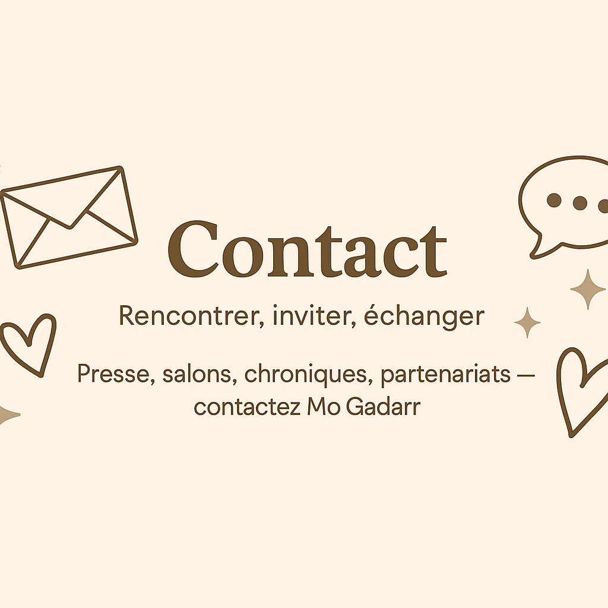

<section class="intro-contact" markdown="1">
> Mo Gadarr captive ses lectrices par des romances où l’émotion, la sensualité et la tension entre les personnages dominent.  
> Elle aime les silences éloquents, les gestes retenus, et les mots qui brûlent doucement la page.
</section>

<section>

  

</section>

::: {.contact-grid}

::: {.contact-card}
### ✉ Prendre contact જ⁀✎✉

Besoin d’informations presse, d’organiser une séance de dédicaces, d’inviter l’auteure à un salon, ou d’échanger pour une chronique ?

<a class="btn btn-primary"
   href="mailto:mogadarr@gmail.com?subject=Contact%20site%20Mogadarr&body=Bonjour%20Mo%2C%0D%0A%0D%0AJe%20vous%20écris%20depuis%20votre%20site.%20Ma%20demande%20concernant%20...%0D%0A%0D%0AMerci%20et%20belle%20journée."
   role="button" aria-label="Envoyer un email">
  ✉️ &nbsp;Écrire à Mo Gadarr
</a>
<a class="btn btn-secondary" href="../romans/index.qmd" role="button" aria-label="Voir les romans">
  Découvrir les romans
</a>

:::

::: {.social-card}
### 🔗 Réseaux

- <i class="bi bi-instagram" aria-hidden="true"></i> **Instagram**  
  <a class="pill-link" href="https://www.instagram.com/mogadarrauteur/" target="_blank" rel="noopener"> @mogadarrauteur </a>

- <i class="bi bi-book" aria-hidden="true"></i> **Goodreads**  
  <a class="pill-link" href="https://www.goodreads.com/search?q=Mo%20Gadarr" target="_blank" rel="noopener"> Mo Gadarr </a>

Astuce&nbsp;: taguez l’auteure et mentionnez le titre de l’ouvrage pour faciliter le partage de chroniques.

:::

:::

<!-- Bouton retour (mobile-friendly) -->

  <a href="index.qmd" class="btn-back" role="button" aria-label="Retour à l’accueil">
    ← Retour à l’accueil
  </a>

