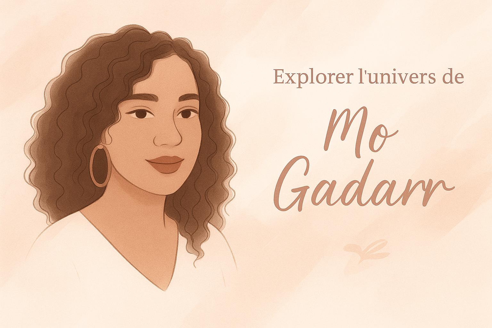

<!-- ===== HERO ===== -->
<section style="margin: 0 0 1.25rem 0;">
  
Mo Gadarr ... Son univers

</section>

  

::: {.actus-section}

## Actualités

::: {.grid .actus-grid}

::: {.g-col-12 .g-col-md-6}
::: {.callout-note appearance="minimal" .actu-card .hearts}
### Black Feelings réimprimé
Après des années, *Black Feelings* est à nouveau disponible à la demande ou en salon.

[En savoir plus »](blog/posts/2026-03-01-reedition-black-feelings/){.btn .btn-primary}
[Contact pour commander »](contact.qmd){.btn .btn-secondary}
:::
:::

::: {.g-col-12 .g-col-md-6}
::: {.callout-note appearance="minimal" .actu-card .hearts .pink-accent}
### Une duologie à paraitre : AT
Exclusivité salon Love story à Mons (Belgique) — 21–22 mars 2026.

[Découvrir »](blog/posts/2026-03-01-duologie-at/){.btn .btn-primary}
:::
:::

:::

:::

::: hero
# Nouveauté - dernier roman

Romance de Noël au cœur des forêts canadiennes — une rencontre qui déjoue les apparences.

[En savoir plus »](dernier-livre.qmd){.btn .btn-primary} [Lire un extrait »](romans/extraits/extrait-buche.qmd){.btn .btn-secondary}
:::

  

::: hero
# L'ensemble des romans

Un espace pour explorer les romans écrits par Mo Gadarr et suivre son actualité. Ceci permet de (re)découvrir l'ensemble des oeuvres. C'est l'occasion de trouver ou retrouver une petite pépite.

[Les romans »](romans/index.qmd){.btn .btn-primary}  [Lire le blog »](blog/index.qmd){.btn .btn-secondary}
:::